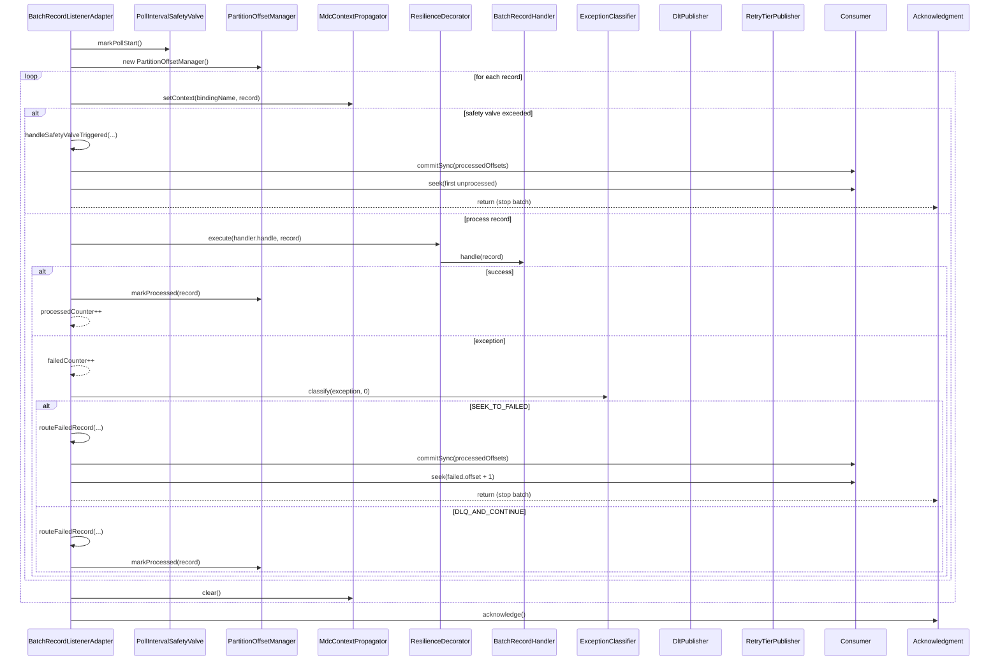

```mermaid
sequenceDiagram
    participant Listener as BatchRecordListenerAdapter
    participant SafetyValve as PollIntervalSafetyValve
    participant OffsetMgr as PartitionOffsetManager
    participant MDC as MdcContextPropagator
    participant Resilience as ResilienceDecorator
    participant Handler as BatchRecordHandler
    participant Classifier as ExceptionClassifier
    participant DLT as DltPublisher
    participant Retry as RetryTierPublisher
    participant Consumer
    participant Ack as Acknowledgment

    Listener->>SafetyValve: markPollStart()
    Listener->>OffsetMgr: new PartitionOffsetManager()
    loop for each record
        Listener->>MDC: setContext(bindingName, record)
        alt safety valve exceeded
            Listener->>Listener: handleSafetyValveTriggered(...)
            Listener->>Consumer: commitSync(processedOffsets)
            Listener->>Consumer: seek(first unprocessed)
            Listener-->>Ack: return (stop batch)
        else process record
            Listener->>Resilience: execute(handler.handle, record)
            Resilience->>Handler: handle(record)
            alt success
                Listener->>OffsetMgr: markProcessed(record)
                Listener-->>Listener: processedCounter++
            else exception
                Listener-->>Listener: failedCounter++
                Listener->>Classifier: classify(exception, 0)
                alt SEEK_TO_FAILED
                    Listener->>Listener: routeFailedRecord(...)
                    Listener->>Consumer: commitSync(processedOffsets)
                    Listener->>Consumer: seek(failed.offset + 1)
                    Listener-->>Ack: return (stop batch)
                else DLQ_AND_CONTINUE
                    Listener->>Listener: routeFailedRecord(...)
                    Listener->>OffsetMgr: markProcessed(record)
                end
            end
        end
        Listener->>MDC: clear()
    end
    Listener->>Ack: acknowledge()
```

