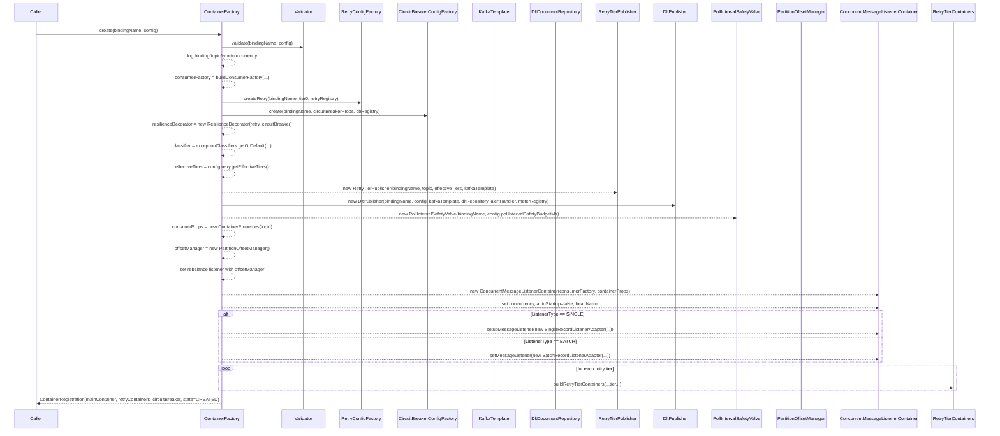

```mermaid
sequenceDiagram
    participant Caller
    participant Factory as ContainerFactory
    participant Validator
    participant RetryCfg as RetryConfigFactory
    participant CBCfg as CircuitBreakerConfigFactory
    participant KafkaTemplate
    participant DltRepo as DltDocumentRepository
    participant RetryPub as RetryTierPublisher
    participant DLTPub as DltPublisher
    participant Safety as PollIntervalSafetyValve
    participant OffsetMgr as PartitionOffsetManager
    participant MainContainer as ConcurrentMessageListenerContainer
    participant RetryContainers as RetryTierContainers

    Caller->>Factory: create(bindingName, config)
    Factory->>Validator: validate(bindingName, config)
    Factory-->>Factory: log binding/topic/type/concurrency
    Factory-->>Factory: consumerFactory = buildConsumerFactory(...)
    Factory->>RetryCfg: createRetry(bindingName, tier0, retryRegistry)
    Factory->>CBCfg: create(bindingName, circuitBreakerProps, cbRegistry)
    Factory-->>Factory: resilienceDecorator = new ResilienceDecorator(retry, circuitBreaker)
    Factory-->>Factory: classifier = exceptionClassifiers.getOrDefault(...)
    Factory-->>Factory: effectiveTiers = config.retry.getEffectiveTiers()
    Factory-->>RetryPub: new RetryTierPublisher(bindingName, topic, effectiveTiers, kafkaTemplate)
    Factory->>DLTPub: new DltPublisher(bindingName, config, kafkaTemplate, dltRepository, alertHandler, meterRegistry)
    Factory-->>Safety: new PollIntervalSafetyValve(bindingName, config.pollIntervalSafetyBudgetMs)
    Factory-->>Factory: containerProps = new ContainerProperties(topic)
    Factory-->>Factory: offsetManager = new PartitionOffsetManager()
    Factory-->>Factory: set rebalance listener with offsetManager
    Factory-->>MainContainer: new ConcurrentMessageListenerContainer(consumerFactory, containerProps)
    Factory-->>MainContainer: set concurrency, autoStartup=false, beanName
    alt ListenerType == SINGLE
        Factory-->>MainContainer: setupMessageListener(new SingleRecordListenerAdapter(...))
    else ListenerType == BATCH
        Factory-->>MainContainer: setMessageListener(new BatchRecordListenerAdapter(...))
    end
    loop for each retry tier
        Factory-->>RetryContainers: buildRetryTierContainers(...tier...)
    end
    Factory-->>Caller: ContainerRegistration(mainContainer, retryContainers, circuitBreaker, state=CREATED)
```

