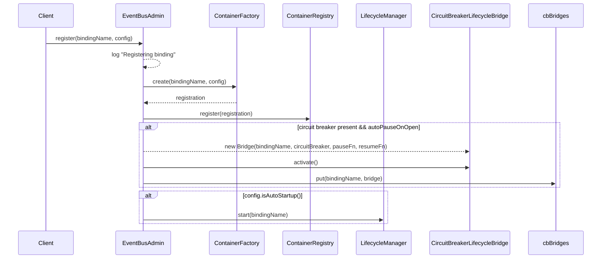

```mermaid
sequenceDiagram
    participant Client
    participant Admin as EventBusAdmin
    participant Factory as ContainerFactory
    participant Registry as ContainerRegistry
    participant Lifecycle as LifecycleManager
    participant Bridge as CircuitBreakerLifecycleBridge
    participant Bridges as cbBridges

    Client->>Admin: register(bindingName, config)
    Admin-->>Admin: log "Registering binding"
    Admin->>Factory: create(bindingName, config)
    Factory-->>Admin: registration
    Admin->>Registry: register(registration)

    alt circuit breaker present && autoPauseOnOpen
        Admin-->>Bridge: new Bridge(bindingName, circuitBreaker, pauseFn, resumeFn)
        Admin->>Bridge: activate()
        Admin->>Bridges: put(bindingName, bridge)
    end

    alt config.isAutoStartup()
        Admin->>Lifecycle: start(bindingName)
    end
```

