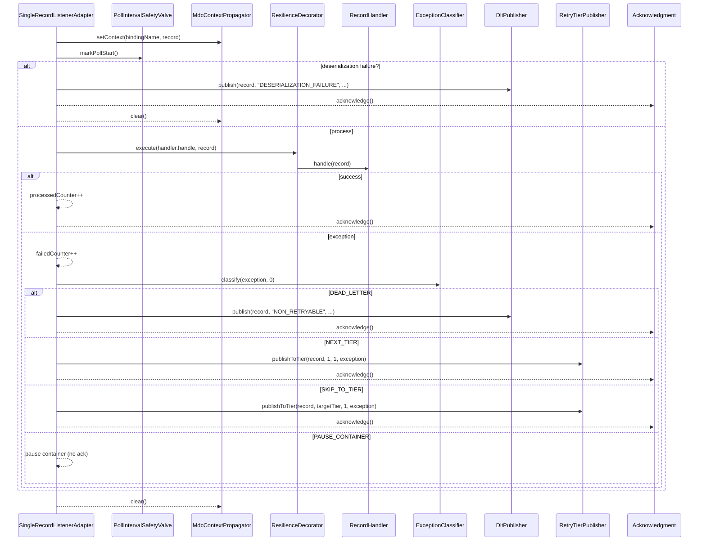

```mermaid
sequenceDiagram
    participant Listener as SingleRecordListenerAdapter
    participant SafetyValve as PollIntervalSafetyValve
    participant MDC as MdcContextPropagator
    participant Resilience as ResilienceDecorator
    participant Handler as RecordHandler
    participant Classifier as ExceptionClassifier
    participant DLT as DltPublisher
    participant Retry as RetryTierPublisher
    participant Ack as Acknowledgment

    Listener->>MDC: setContext(bindingName, record)
    Listener->>SafetyValve: markPollStart()
    alt deserialization failure?
        Listener->>DLT: publish(record, "DESERIALIZATION_FAILURE", ...)
        Listener-->>Ack: acknowledge()
        Listener-->>MDC: clear()
    else process
        Listener->>Resilience: execute(handler.handle, record)
        Resilience->>Handler: handle(record)
        alt success
            Listener-->>Listener: processedCounter++
            Listener-->>Ack: acknowledge()
        else exception
            Listener-->>Listener: failedCounter++
            Listener->>Classifier: classify(exception, 0)
            alt DEAD_LETTER
                Listener->>DLT: publish(record, "NON_RETRYABLE", ...)
                Listener-->>Ack: acknowledge()
            else NEXT_TIER
                Listener->>Retry: publishToTier(record, 1, 1, exception)
                Listener-->>Ack: acknowledge()
            else SKIP_TO_TIER
                Listener->>Retry: publishToTier(record, targetTier, 1, exception)
                Listener-->>Ack: acknowledge()
            else PAUSE_CONTAINER
                Listener-->>Listener: pause container (no ack)
            end
        end
    end
    Listener-->>MDC: clear()
```
